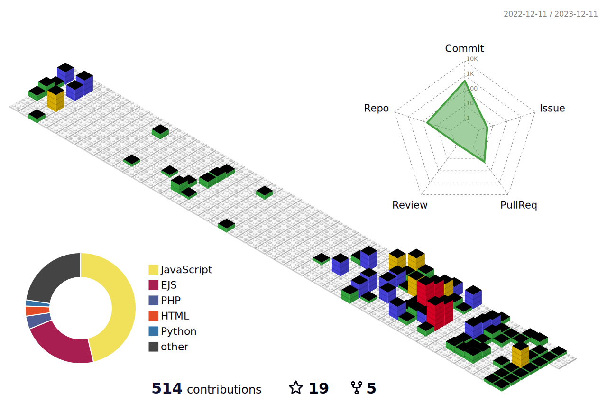

  
  
  
  <!-- 
 
    
  
 -->
  

    
    
  

  
  <!-- <picture>
    <source media="(prefers-color-scheme: dark)"  srcset="./profile-3d-contrib/profile-night-green.svg" />
    <source media="(prefers-color-scheme: light)" srcset="./profile-3d-contrib/profile-green-animate.svg" />
    
  </picture> -->

## Core Technologies

  
  
  
  
  
  
  

## Development Experience

### Svelte Development
- Building reactive web applications with SvelteKit
- Creating reusable components and stores
- Implementing responsive designs and animations
- Working with Svelte's built-in state management
- Integrating with various APIs and backend services

### Flutter Development
- Developing cross-platform mobile applications
- Creating custom widgets and animations
- Implementing state management solutions (Provider, Riverpod, Bloc)
- Building responsive and adaptive UIs
- Working with Firebase and other backend services
- Optimizing app performance and implementing best practices

  

    <h2> Additional Skills & Tools </h2>
  

  

    
  

  

    
    
  

 
  

  

  <!-- ## Star History

   -->

 

  -✩- Featured Projects -✩-

